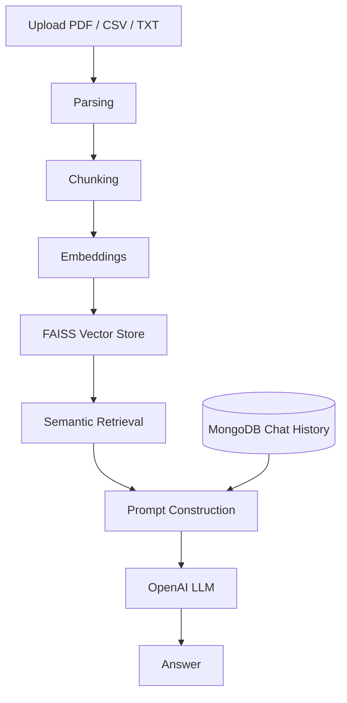

# RAGify - Lightweight RAG Service with FastAPI, FAISS, and OpenAI

**RAGify** is a minimal and powerful **Retrieval-Augmented Generation (RAG)** service built with **FastAPI**, **FAISS**, and **OpenAI API**.
It allows you to **upload PDF or CSV documents, store them as vector embeddings locally using FAISS, and chat with them using OpenAI's GPT models.**

---

## What it does

RAGify is a Retrieval-Augmented Generation (RAG) service that enables users to upload documents and interact with them using natural language.

Traditional Large Language Models (LLMs) do not have access to a user's private documents and may generate answers that are generic or not grounded in the actual content. RAGify addresses this limitation by retrieving relevant information from uploaded documents before generating a response.

The system supports PDF, CSV, and TXT files, performs semantic retrieval using vector embeddings, and generates context-aware responses using OpenAI language models.

---

## Architecture



Conversation history is stored in MongoDB and cached in memory to improve response times and reduce database access.


---

## Tech Stack
### Backend
- Python
- FastAPI
### Retrieval Layer
- LangChain
- FAISS
- OpenAI Embeddings
- SentenceTransformers (MiniLM-L6-v2)
### Data Processing
- PyMuPDF
- Pandas
### Storage
- MongoDB
- In-Memory Cache
### Infrastructure
- Docker
- Uvicorn
### AI Services
- OpenAI GPT Models
- OpenAI Embeddings API

---

## Project Structure

```text
app/
├── routers/
│   ├── chat.py
│   └── upload.py
├── services/
│   ├── embedding.py
│   ├── faiss_store.py
│   ├── file_parser.py
│   ├── memory.py
│   └── openai_llm.py
└── main.py
```
---

## Design Decisions
### Why FAISS?

FAISS provides efficient vector similarity search and can run locally without requiring an external vector database service.

### Why MongoDB?

Chat history is naturally represented as flexible JSON-like documents. MongoDB allows simple storage and retrieval of conversations by user and session.

### Why separate Retrieval from Generation?

Keeping retrieval and generation independent makes the system easier to maintain, test, and extend. The embedding model, vector store, or LLM provider can be replaced without redesigning the entire pipeline.

### Why store history both in memory and MongoDB?

MongoDB provides persistence, while the in-memory cache improves performance by avoiding repeated database queries for active conversations.

---

## Example Workflow
### 1. Upload a document

Upload a PDF, CSV, or TXT file through the /upload endpoint.

### 2. Document indexing

The service:

- Extracts text
- Splits it into chunks
- Generates embeddings
- Stores vectors in FAISS
  
### 3. Ask a question

The user sends a question through /chat or /async_chat.

### 4. Semantic retrieval

Relevant chunks are retrieved from FAISS using vector similarity search.

### 5. Response generation

The retrieved context and chat history are combined into a prompt and sent to the LLM, which generates a grounded response.

---

## Features

- Upload and parse **PDF** and **CSV** files.
- Embeds documents using **local SentenceTransformer (MiniLM-L6-v2)** or **OpenAI Embeddings**.
- Stores vectors efficiently using **FAISS local index**.
- **Chat** with your documents using **OpenAI GPT models (like GPT-3.5-Turbo)**.
- Real-time **async chat** endpoint streams tokens as they are generated.
- Lightweight and privacy-friendly (documents never leave your machine).
- Duplicate file uploads are automatically detected using **SHA256 hashing**.
- Simple to run locally or in Docker.

---

## 🛠️ Installation

### 🔧 Running Locally (Recommended for development)

1. Clone the repository:
```bash
git clone https://github.com/yairyaakov/rag-service.git
cd rag-service
```

2.	Create .env file in the root:
```bash
OPENAI_API_KEY=sk-xxxxxxxxxxxxxxxxxxxxxxxx
MONGO_URI=mongodb+srv://<user>:<password>@cluster.mongodb.net
MONGO_DB=rag_service
```

3.	Install dependencies:
```bash
python -m venv venv
source venv/bin/activate
pip install -r requirements.txt
```

4.	Run the FastAPI server:
```bash
uvicorn app.main:app --reload
```
5.	Visit:
  
•	Swagger Docs: http://localhost:8000/docs <br>
•	ReDoc: http://localhost:8000/redoc

### Running with Docker <br>
1.	Build the image:
```bash
docker build -t rag-service .
```

2.	Run the container:
```bash
docker run --env-file .env -p 8000:8000 ragify
```

## API Usage Example

1. Upload a File <br>
	•	POST /upload <br>
	•	Body: form-data <br>
	•	file: (upload your .pdf or .csv) <br>

2. Chat with your data <br>
        •       POST /chat <br>
        •       Query Params: <br>
        •       user_input: "What is this document about?" <br>
        •       session_id: "my-session-id" <br>
        •       user_id: "my-user"
        <br><br>
        •       POST /async_chat <br>
        •       Same query params as /chat, but streams the response token-by-token

3. Retrieve chat history <br>
        •       GET /history <br>
        •       Query Params: <br>
        •       user_id: "my-user" <br>
        •       session_id: "my-session-id" (optional)
        <br>Omit the session_id to retrieve history for all sessions of the user.

Chat history is cached in memory and also stored in MongoDB per user and session. \
If the service restarts or the cache is empty, history is loaded from the database.
Cached sessions are automatically removed after 15 minutes of inactivity.

---

## License

This project is licensed under the MIT License.
Feel free to use, modify, and distribute it.

---

## Contributing

Contributions are welcome!
	1.	Fork the repo
	2.	Create your feature branch (git checkout -b feature/awesome-feature)
	3.	Commit your changes (git commit -m 'Add amazing feature')
	4.	Push to the branch (git push origin feature/awesome-feature)
	5.	Open a Pull Request 

